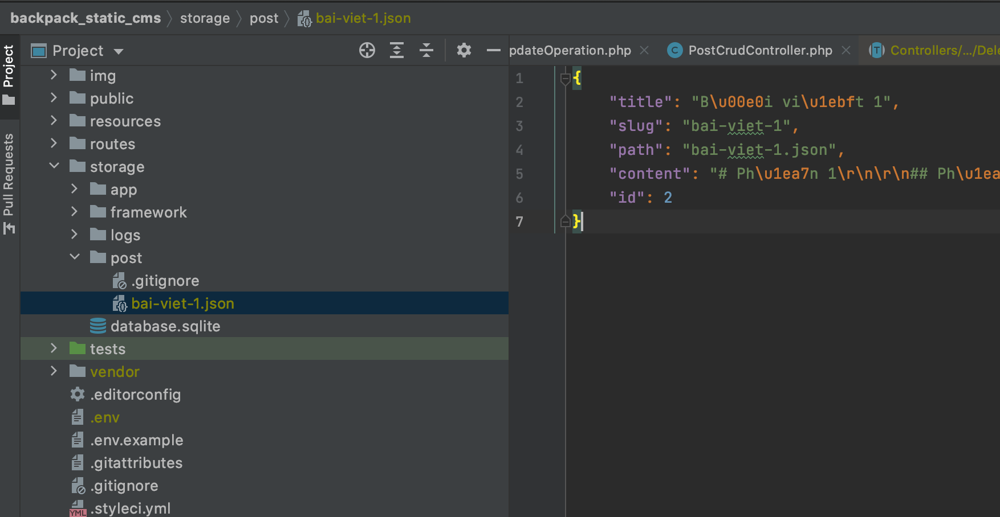
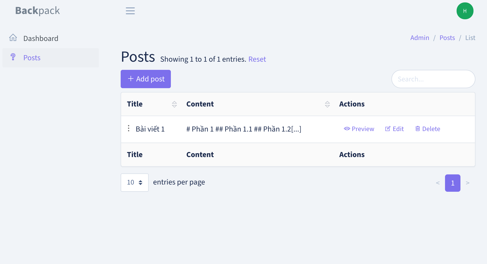

# Backpack Static CMS

Ví dụ sử dụng `backpack` và `calebporzio/sushi` để làm 1 cms với các Post được lưu dạng file tĩnh

## Lưu file



## List



## Todo

- [ ] Sử dụng Elfinder để quản lý ảnh
- [ ] Khi các nội dung bài viết dài, sử dụng accessor để lưu field content vào file riêng
- [ ] Sử dụng sqlite hoặc json để lưu thông tin thay vì sử dụng cấu trúc thư mục


## Install

- Clone
- Chạy composer
- Cấu hình env
- Chạy migrate
- Tạo người dùng
- Test

## Ví dụ file .env để test với db sqlite

Cần `touch storage/database.sqlite` trước khi chạy migrate

```ini
APP_NAME=Laravel
APP_ENV=local
APP_KEY=base64:1RLOLAsxxKpLPkD5hH7QYUj4/L787xHHqHKYpcY8b9w=
APP_DEBUG=true
APP_URL=http://localhost

LOG_CHANNEL=stack

DB_CONNECTION=sqlite
DB_HOST=127.0.0.1
DB_PORT=3306
DB_DATABASE={$PWD}/storage/database.sqlite
DB_USERNAME=root
DB_PASSWORD=

BROADCAST_DRIVER=log
CACHE_DRIVER=file
QUEUE_CONNECTION=sync
SESSION_DRIVER=file
SESSION_LIFETIME=120

REDIS_HOST=127.0.0.1
REDIS_PASSWORD=null
REDIS_PORT=6379

MAIL_DRIVER=smtp
MAIL_HOST=smtp.mailtrap.io
MAIL_PORT=2525
MAIL_USERNAME=null
MAIL_PASSWORD=null
MAIL_ENCRYPTION=null
MAIL_FROM_ADDRESS=null
MAIL_FROM_NAME="${APP_NAME}"

AWS_ACCESS_KEY_ID=
AWS_SECRET_ACCESS_KEY=
AWS_DEFAULT_REGION=us-east-1
AWS_BUCKET=

PUSHER_APP_ID=
PUSHER_APP_KEY=
PUSHER_APP_SECRET=
PUSHER_APP_CLUSTER=mt1

MIX_PUSHER_APP_KEY="${PUSHER_APP_KEY}"
MIX_PUSHER_APP_CLUSTER="${PUSHER_APP_CLUSTER}"

```
